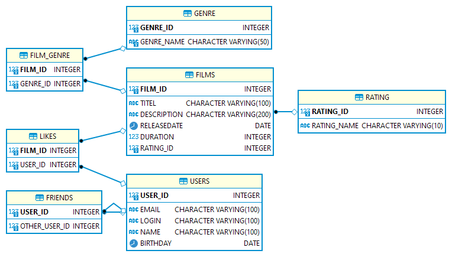

# java-filmorate
Template repository for Filmorate project.

## Entity-relationship diagram:


### Example: all users
```
SELECT *
FROM users;
```

### Example: all films
```
SELECT *
FROM film;
```

### Example: top 10 films
```
SELECT *
FROM film
WHERE film_id IN (SELECT film_id
                  FROM likes
                  GROUP BY film_id
                  ORDER BY AVG(user_id) DESC
                  LIMIT 10);
```
